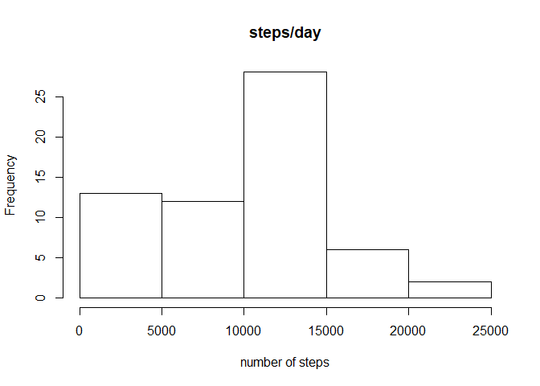
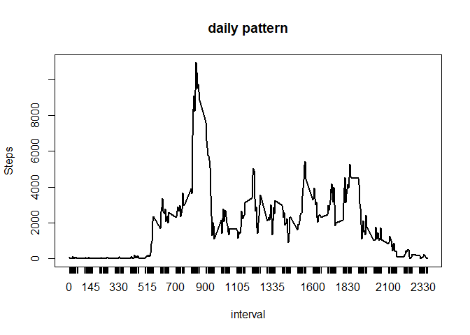
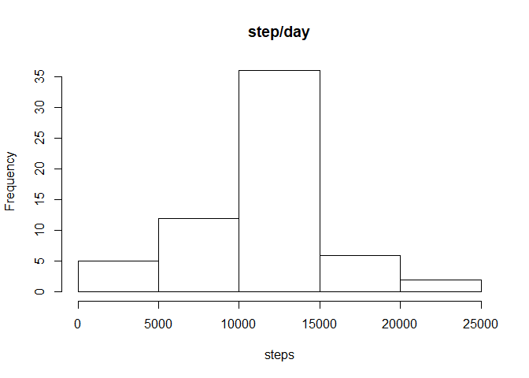
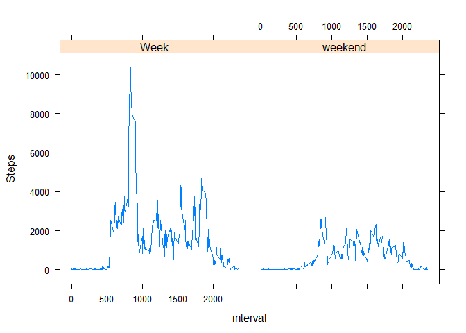

## Loading and preprocessing the data


```r
library(tidyverse)
```

```
## -- Attaching packages --------------------------------------------------------------------- tidyverse 1.2.1 --
```

```
## v ggplot2 3.0.0     v purrr   0.2.5
## v tibble  1.4.2     v dplyr   0.7.6
## v tidyr   0.8.1     v stringr 1.3.1
## v readr   1.1.1     v forcats 0.3.0
```

```
## -- Conflicts ------------------------------------------------------------------------ tidyverse_conflicts() --
## x dplyr::filter() masks stats::filter()
## x dplyr::lag()    masks stats::lag()
```

```r
library(magrittr)
```

```
## 
## Attaching package: 'magrittr'
```

```
## The following object is masked from 'package:purrr':
## 
##     set_names
```

```
## The following object is masked from 'package:tidyr':
## 
##     extract
```

```r
library(lattice)
unzip("activity.zip")
activity_data <- read.csv(file = "activity.csv")
```

## What is mean total number of steps taken per day?


```r
#sum of steps/day
activity_data %>% xtabs(formula = steps~date)
```

```
## date
## 2012-10-01 2012-10-02 2012-10-03 2012-10-04 2012-10-05 2012-10-06 
##          0        126      11352      12116      13294      15420 
## 2012-10-07 2012-10-08 2012-10-09 2012-10-10 2012-10-11 2012-10-12 
##      11015          0      12811       9900      10304      17382 
## 2012-10-13 2012-10-14 2012-10-15 2012-10-16 2012-10-17 2012-10-18 
##      12426      15098      10139      15084      13452      10056 
## 2012-10-19 2012-10-20 2012-10-21 2012-10-22 2012-10-23 2012-10-24 
##      11829      10395       8821      13460       8918       8355 
## 2012-10-25 2012-10-26 2012-10-27 2012-10-28 2012-10-29 2012-10-30 
##       2492       6778      10119      11458       5018       9819 
## 2012-10-31 2012-11-01 2012-11-02 2012-11-03 2012-11-04 2012-11-05 
##      15414          0      10600      10571          0      10439 
## 2012-11-06 2012-11-07 2012-11-08 2012-11-09 2012-11-10 2012-11-11 
##       8334      12883       3219          0          0      12608 
## 2012-11-12 2012-11-13 2012-11-14 2012-11-15 2012-11-16 2012-11-17 
##      10765       7336          0         41       5441      14339 
## 2012-11-18 2012-11-19 2012-11-20 2012-11-21 2012-11-22 2012-11-23 
##      15110       8841       4472      12787      20427      21194 
## 2012-11-24 2012-11-25 2012-11-26 2012-11-27 2012-11-28 2012-11-29 
##      14478      11834      11162      13646      10183       7047 
## 2012-11-30 
##          0
```

```r
#histogram
activity_data %>% xtabs(formula = steps~date)%>% 
  hist(main = "steps/day", xlab = "number of steps")
```

<!-- -->

```r
#mean and median
activity_data%>% xtabs(formula = steps~date) %>% mean()
```

```
## [1] 9354.23
```

```r
activity_data%>% xtabs(formula = steps~date) %>% median()
```

```
## [1] 10395
```

## What is the average daily activity pattern?


```r
# plotting data
activity_data %>% xtabs(formula = steps~interval) %>% plot(type = "l", 
                                                           ylab = "Steps",
                                                           main = "daily pattern")
```

<!-- -->

```r
#calculating max value
activity_data %>% xtabs(formula = steps~interval) %>% .[which.max(.)]
```

```
##   835 
## 10927
```

## Imputing missing values


```r
#list of unique intervals
inter <- unique(activity_data$interval) %>% as.character()
#new dataframe
activity_data2 <- activity_data
#mutating dataframe, replace all NA`s with interval mean
for (i in inter) {
  m <- activity_data2[activity_data2$interval==i, 1] %>% mean(na.rm=T)
  activity_data2[activity_data2$interval==i, 1] %<>% replace_na(m)
}
#plotting hist
activity_data2 %>% xtabs(formula = steps~date) %>% hist(main = "step/day", 
                                                        xlab = "steps")
```

<!-- -->

```r
#calculating mean
activity_data2 %>% xtabs(formula = steps~date) %>% mean()
```

```
## [1] 10766.19
```

```r
#calculating median
activity_data2 %>% xtabs(formula = steps~date) %>% median()
```

```
## [1] 10766.19
```

## Are there differences in activity patterns between weekdays and weekends?


```r
#creating week and weekend days col
activity_data2 %<>% mutate(date = date %>% as.Date()) %>% 
  mutate(weekday = weekdays(date) %>% gsub(pattern = "Saturday|Sunday", 
                                           replacement = "weekend") %>% 
           gsub(pattern = "Monday|Tuesday|Wednesday|Thursday|Friday", 
                replacement = "Week") %>% as.factor())
xdf <- activity_data2 %>% xtabs(formula = steps~interval+weekday) %>% 
  as.data.frame() %>% rename(steps = Freq) #dataframe with sums of intervals for week/weekend
#creating plot
xyplot(xdf$steps~xdf$interval %>% as.character %>% as.numeric()|xdf$weekday, type = "l",
       xlab = "interval", ylab = "Steps")
```

<!-- -->

